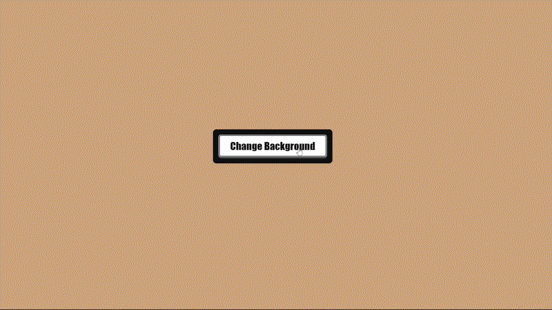
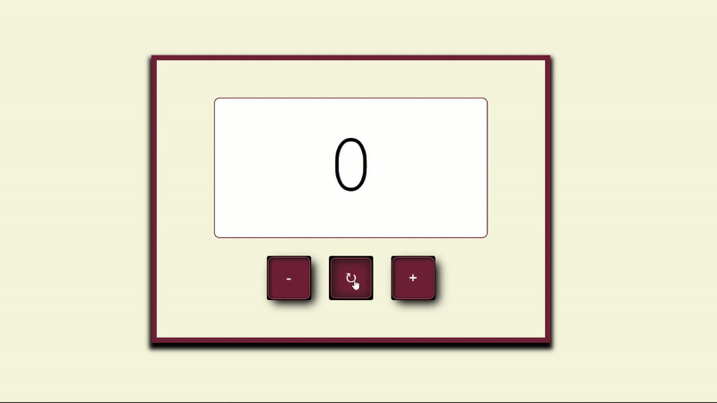
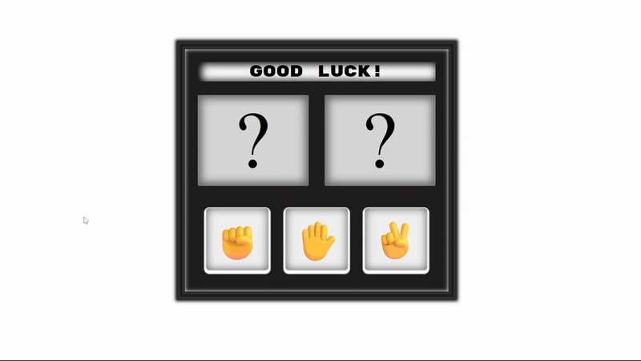

# Javascript-Practice

## Projects

| # | Project | Description | Demo |
|---|---------|-------------|------|
| 1 | [Background Flipper](projects/background-flipper) | Dynamically changes the background color using Math.random() and DOM manipulation. |  |
| 2 | [Counter](projects/counter) | Basic counter using button event handler to increase/decrease/reset the count. |  |
| 3 | [Rock, Paper, Scissors Game](projects/rock-paper-scissors) | A simple interactive **Rock-Paper-Scissors** game built with **HTML, CSS, and JavaScript**.  
The player competes against a random bot choice, and the result is displayed immediately.
 |  |
