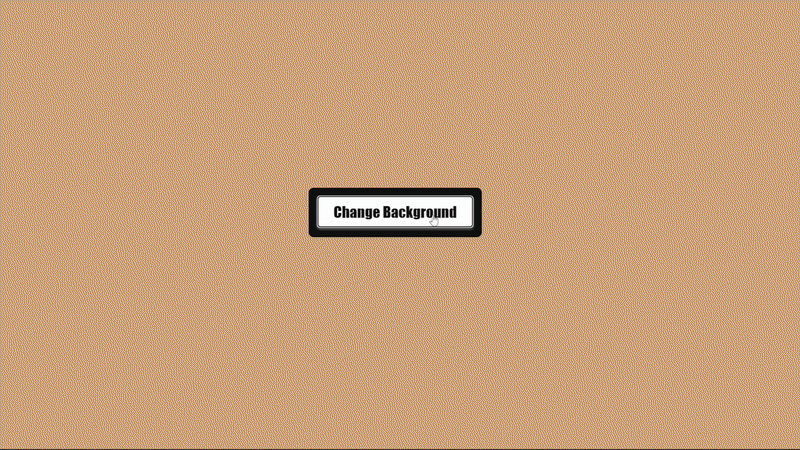

# Javascript-Practice

## Projects

## Projects

| # | Project | Description | Demo |
|---|---------|-------------|------|
| 1 | [Background Flipper](projects/background-flipper) | Dynamically changes the background color using Math.random() and DOM manipulation. |  |
| 2 | [Todo List](projects/todo-list) | A console-based todo list to practice arrays and loops. |  |
| 3 | [Calculator](projects/calculator) | Simple arithmetic calculator using functions and event listeners. |  |

# 1. Background Flipper
A Small JavaScript project that dynamically changes the background color of the webpage. Built to practice working with functions, DOM Manipulation, random numbers.
## Features
- Randomly changes background when the button is clicked.
- Uses `Math.floor()` and `Math.random()` for randomization.
## Gif

## How It Works
## How to Run
## Skills Practiced
## Improvements
