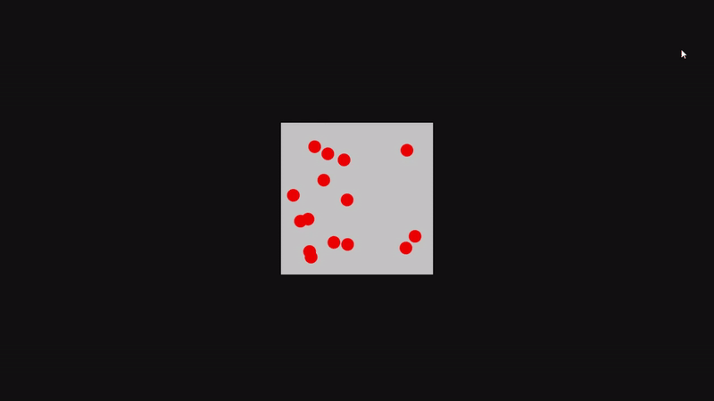

# Particle Bounce Simulation

A multiple particle with random velocity bouncing inside a container. This project is design to understand velocity in animations. 

##  Key Concepts Explained
##Position
  - `posX`, `posY` represent the starting position of the particle.
  - These values will get updated using:
    ```js 
    posX = posX + velX;
    posY = posY + velY;
    ```
##Velocity
  - Represents the speed and in what direction the particle moves.
  - positive value = moving to the right/down
  - negative value = moving to the left/up
    ```js 
    let velX = (Math.random() - 0.5) * 5;
    let velY = (Math.random() - 0.5) * 5;
    ```
##Bouncing Logic
  - Velocity is reversed when hitting the wall.
    ```js 
    if (posX <= 0 || posX >= 275) {
        velX *= -1;
    }
    if (posY <= 0 || posY >= 275) {
        velY *= -1;
    }
    ```
    - This works because velocity already knows the direction.
    - Flipping the sign reverse the movement naturally.
  
##  Demo



##  How It Works
1. Create Multiple Particles using for loop.
2. Give each particle a random position and velocity.
3. Move them every frame.
4. Reversed the velocity on collision with walls.
5. Repeat the animation using recursive setTimeout.

##  Room for Improvements
- Add particle to particle collision.
- Allow user interaction, click to add particle.

